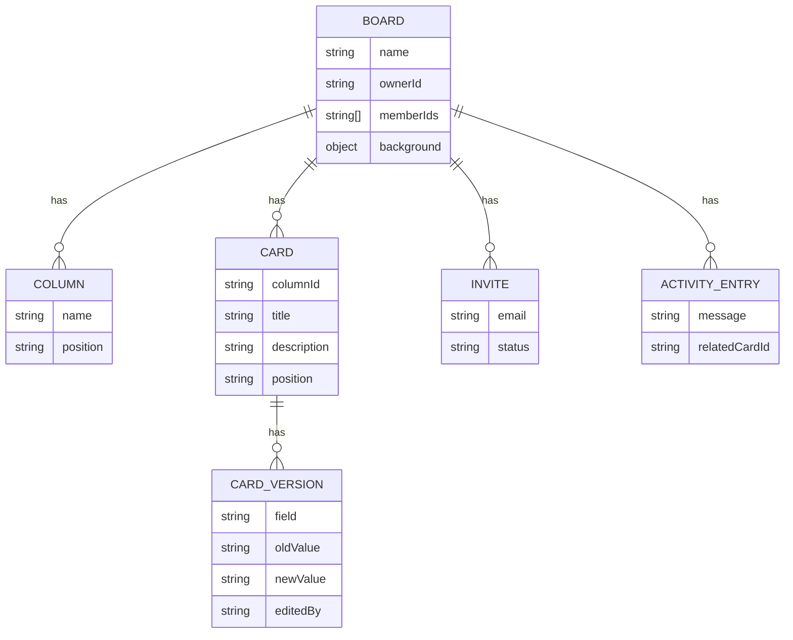

Collections are nested under their board (`boards/{boardId}/...`) rather than kept top-level with a `boardId` field.

<Note>
  Every query in the MVP is already scoped to one board at a time — nesting means a single membership check at the board level secures the whole subtree via Firestore's rules inheritance, instead of repeating an equality filter on `boardId` in every rule.
</Note>



## Collections

<CodeGroup>
```ts boards/{boardId}
interface Board {
  name: string;
  ownerId: string;
  memberIds: string[];       // used directly by security rules
  background?: {
    url: string;
    photographerName: string;
    photographerUrl: string;
    unsplashId: string;
  };
  createdAt: Timestamp;
}
```

```ts boards/{boardId}/columns/{columnId}
interface Column {
  name: string;
  position: string;          // fractional-index rank string
}
```

```ts boards/{boardId}/cards/{cardId}
interface Card {
  columnId: string;
  title: string;
  description: string;
  position: string;          // fractional-index rank string
  createdAt: Timestamp;
  updatedAt: Timestamp;
}
```

```ts boards/{boardId}/cards/{cardId}/versions/{versionId}
interface CardVersion {
  field: string;
  oldValue: string;
  newValue: string;
  editedBy: string;          // uid
  editedAt: Timestamp;
}
```

```ts boards/{boardId}/activityFeed/{entryId}
interface ActivityEntry {
  message: string;           // pre-formatted, readable line
  createdAt: Timestamp;
  relatedCardId?: string;
}
```

```ts boards/{boardId}/invites/{inviteId}
interface Invite {
  email: string;
  status: "pending" | "accepted" | "expired";
  invitedBy: string;         // uid
  createdAt: Timestamp;
}
```

```ts users/{uid}
interface UserProfile {
  displayName: string;
  email: string;
  avatarUrl?: string;
}
```
</CodeGroup>

<Info>
  `users/{uid}` is the one top-level collection — identity spans boards, so it can't live nested under any single board.
</Info>
